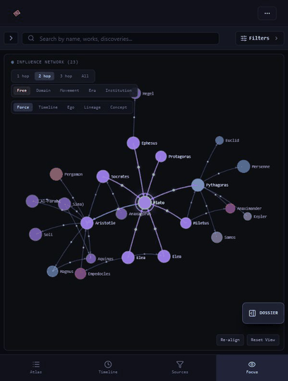
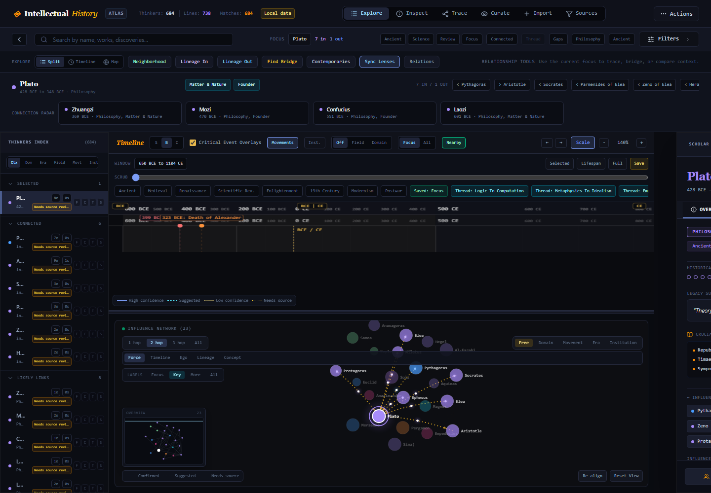

# Intellectual History Knowledge Atlas

An interactive atlas for exploring thinkers, timelines, influence relationships, topics, curated intellectual threads, and externally sourced import candidates.



The app is designed for iterative curation. It starts from the bundled dataset in `src/data.ts`, lets you add or review local changes in the browser, and stores those browser-side changes in `localStorage`.

## What You Can Do

- Explore thinkers by timeline, graph neighborhood, field, era, region, topic, and search.
- Select a thinker to inspect works, notes, tags, relationships, and related people.
- Follow curated intellectual threads one step at a time.
- Find directed relationship paths between two thinkers.
- Add thinkers and relationships manually.
- Import people from Wikidata through the local Express backend.
- Review import candidates, duplicates, suggested links, and sparse graph neighborhoods.
- Run a dataset QA report for field/era coverage, isolated people, sparse high-bridge thinkers, and conflicting explicit edges.

## Requirements

- Node.js 20 or newer.
- npm.
- Network access for Wikidata import lookup.

No credentials are required for the current local app and Wikidata search flow.

## Run Locally

```bash
npm install
npm run dev
```

Open [http://localhost:3000](http://localhost:3000).

The dev server runs the Express backend and Vite frontend from `server.ts`.

## First Use Checklist

1. Start the app with `npm run dev`.
2. Open [http://localhost:3000](http://localhost:3000).
3. Use the search box to select a familiar thinker such as Plato, Aristotle, Kant, Darwin, or Turing.
4. Open **Filters** and narrow by field, topic, era, region, or year range.
5. Switch between **Explore**, **Timeline**, and **Map** in the header to inspect the same filtered dataset in different views.
6. Open **Workbench** when you want to review suggested links, tags, imports, or duplicates.
7. Run `npm run qa:data` after source-data or thread edits to inspect graph coverage and TODO-oriented cleanup targets.

The app is a fixed-height workspace. The browser page itself does not scroll much; instead, the index, filters, workbench, timeline, dossier, path finder, and modal surfaces each have their own internal scroll regions.

## Run In GitHub Codespaces

1. Open the repository on GitHub.
2. Choose **Code** -> **Codespaces** -> **Create codespace on main**.
3. Wait for dependencies to install.
4. Run:

```bash
npm run dev
```

Codespaces will forward port `3000`. Open the forwarded URL to use the app.

## Production Build

```bash
npm run build
npm run start
```

`npm run build` produces:

- `dist/` Vite frontend assets.
- `dist/server.cjs` bundled Express server.

The build currently emits a Vite chunk-size warning because the main frontend bundle is large. This is a warning, not a failed build.

## Useful Commands

```bash
npm run dev       # Start local development server
npm run lint      # TypeScript check
npm run build     # Build frontend and server
npm run start     # Serve the production build
npm run qa:data   # Print dataset QA report
npm run clean     # Remove generated build outputs
```

On Windows PowerShell, use `npm.cmd` if script execution policy blocks `npm`:

```powershell
npm.cmd run dev
npm.cmd run lint
npm.cmd run build
```

## Data Persistence

The app persists local browser edits in `localStorage`.

Local data is private to the current browser profile and device. It is not uploaded by the app, but it also is not shared across browsers, machines, deployments, or private/incognito sessions unless you export and restore JSON yourself.

Important keys include:

- `atlas_state_v7`: versioned local thinker and relationship state.
- `atlas_import_queue_v2`: staged import review queue.
- `atlas_import_audit_log_v1`: import review history.
- `atlas_link_review_queue_v1`: queued relationship suggestions.
- `atlas_rejected_link_suggestions_v1`: rejected link suggestions.

Older `atlas_people_v6` and `atlas_edges_v6` storage is migrated into `atlas_state_v7` on startup.

Use the app's reset control if you want to restore the bundled seed dataset. Resetting clears local people, edges, import queues, audit logs, rejected suggestions, and link review queues.

## Main Interface



The app has three primary exploration surfaces:

- **Timeline**: shows people by date, era bands, works, movements, and relationship arcs.
- **Network graph**: shows the selected person and nearby relationship neighborhood.
- **Detail panel**: shows the selected person's metadata, works, tags, and relationships.

Select a thinker from the timeline, graph, index, search results, thread stepper, path finder, or review lists to focus the app.

For the next major UI direction, see [UI Redesign: Network-First Atlas Workspace](docs/ui-redesign.md). The redesign separates the Influence Atlas from Source Studio so network exploration and scholar dossiers are no longer crowded by import, export, and provenance-management tools.

For the long-term data direction, see [Automated Validation Roadmap](docs/automated-validation-roadmap.md). It outlines milestones for replacing manual import and edge review with automated source collection, claim validation, graph repair, and canonical dataset generation.

### Header Controls

The header is the global navigation and action bar:

- **Explore** shows the combined split timeline and network workspace.
- **Timeline** expands the historical timeline to the main workspace.
- **Map** expands the relationship network graph to the main workspace.
- **Add Thinker** opens a local manual-entry modal.
- **Workbench** opens the curation and review panel.
- **Find Path** opens the directed relationship path finder.
- **Reset** restores the bundled dataset and clears local browser-side edits.

The second toolbar includes search, focus context, relationship shortcuts, filters, and quick lineage tools. These actions operate on the currently selected thinker whenever one is focused.

### Screen Layout And Scrolling

The atlas uses nested work areas rather than one long document page:

- The left thinker index scrolls independently.
- The filter drawer scrolls internally when many facets are visible.
- The timeline canvas scrolls and pans inside its own viewport.
- The network map pans and zooms inside its canvas.
- The right dossier drawer scrolls independently from the rest of the app.
- The Workbench and Path Finder panels have their own scroll behavior.

If content appears to continue below the visible window, try scrolling inside the active panel itself rather than the outer page. For example, place the pointer over the dossier, Workbench, filter drawer, or index list before scrolling.

## Search And Filters

Use the top search input to filter people by name, works, notes, field, region, era, and tags.

The filter drawer supports:

- Field/domain filters.
- Subfield/topic filters.
- Lens tags inferred from fields, notes, works, and imported source text.
- Era filters.
- Region filters.
- Year range filters.

Filtering affects the visible people in the main timeline and graph surfaces.

Recommended filter workflow:

1. Start with a broad search or field filter.
2. Add one or two topic or lens tags.
3. Narrow by era or year range only after the result set is already meaningful.
4. Use **Clear Filters** to reset the current exploration state.

## Timeline

The timeline is useful for historical placement and lineage inspection.

Common controls include:

- Toggle movements, relationship edges, works, labels, and events.
- Use linear or log-style scaling.
- Pan and zoom through the historical range.
- Select a person to highlight incoming and outgoing relationship arcs.
- Follow highlighted relationship paths from Path Finder or curated threads.

Timeline tips:

- Use the view toggles to reduce visual clutter before inspecting a dense period.
- Use pan and zoom when a period is crowded rather than narrowing the date range too early.
- Select a person first, then use **Lineage In**, **Lineage Out**, or **Neighborhood** to highlight nearby relationships.

## Network Graph

The graph focuses on relationship neighborhoods. It highlights:

- The selected thinker.
- Incoming and outgoing explicit edges.
- Highlighted path or thread steps.
- Important bridge figures.

The focus depth control changes how much of the selected thinker's surrounding network is visible.

Network tips:

- **1 hop** is best for auditing immediate predecessors and successors.
- **2 hop** and **3 hop** reveal intermediate bridges.
- **All** is useful for global shape, but dense enough that labels and edges are less readable.
- Use **Re-align** when the simulation has settled awkwardly.
- Use **Reset View** after heavy panning or zooming.

## Detail Panel

The detail panel is the main curation surface for a selected thinker. It shows:

- Core biographical metadata.
- Field, subfield, era, region, movement, and bridge score.
- Works and notes.
- Relationship lists.
- Topic and lens tags.
- Source/review information where available.

From the detail panel and surrounding controls you can add relationships, edit tags, inspect sparse neighborhoods, and jump to related people.

The detail panel has three tabs:

- **Overview**: metadata, notes, works, immediate predecessors, and immediate successors.
- **Context**: contemporaries, field peers, and era peers.
- **Influences**: a compact upstream and downstream relationship map, plus three-hop lineage lists.

The bottom actions show contemporaries and downstream successor maps. Those overlays sit over the dossier and can be closed to return to the selected thinker.

## Path Finder

Open Path Finder to search for a directed relationship path between two thinkers.

Paths follow explicit directed relationship edges from source to target. When a path is found, the timeline and graph highlight each step.

Use Path Finder when you want to test whether the current graph already supports an intellectual lineage. If no path is found, the missing bridge is usually a good candidate for TODO-driven dataset work, provided a historically defensible edge exists.

## Curated Threads

Curated threads live in `src/threads.ts` as `CANONICAL_THREADS`.

Each thread contains:

- `id`
- `title`
- `field`
- `purpose`
- ordered `people`
- carried-forward `concepts`
- expected `edgeTypes`
- confidence level

The thread viewer lets you step through a chain one relationship at a time. Thread cards also report:

- missing people
- edge gaps
- weak edges

Use this to audit whether an intellectual lineage is well-supported or still needs intermediate figures and better source claims.

Thread maintenance workflow:

1. Add or update people and edges in `src/data.ts`.
2. Add thread definitions in `src/threads.ts`.
3. Run `npm run qa:data`.
4. Fix missing people, weak edges, and thread gaps reported by the QA output.
5. Run `npm run lint` and `npm run build`.

## Workbench

The Workbench groups review and curation tasks into tabs.

### Links

Use link review to inspect suggested relationships. Suggestions may be categorized as:

- likely influence
- direct mentorship
- collaboration
- parallel development
- source-context neighbor
- needs review

You can accept or reject suggestions. Rejected pairs are stored so they are not immediately suggested again.

Accepted relationship suggestions are local browser edits unless you also update `src/data.ts`. Treat the Workbench as a curation aid, then preserve important accepted edges in source data when they should become part of the bundled atlas.

### Tags

Use tag review to inspect inferred topics and lens tags for a selected thinker.

Tags are derived from fields, subfields, works, notes, and imported source descriptions. They help filtering and topic grouping.

### Imports

Use import review to stage, edit, accept, merge, skip, or clear imported people.

Queued import items can have statuses:

- `queued`
- `edited`
- `accepted`
- `skipped`
- `duplicate`

The queue also uses confidence thresholds and quality labels to identify ready, duplicate, sparse, or source-gap candidates.

### Duplicates

Duplicate detection compares candidates and existing thinkers by:

- normalized name
- alternate names
- birth/death proximity
- Wikidata/source URL
- works
- movement

Duplicate candidates can be inspected and merged into the existing thinker record.

Merge carefully: prefer preserving source URLs, aliases, works, notes, and high-confidence dates. A merge affects local browser state; source-data changes still need to be made in `src/data.ts` if the result should be committed.

## Wikidata Import

The local backend exposes:

```text
GET /api/import/wikidata/search?q=<query>
```

The app uses this endpoint to search Wikidata and normalize candidate people into local import drafts.

Imported candidates can include:

- name
- birth/death years
- description
- fields and occupations
- region
- notable works
- movement
- Wikidata entity URL
- Wikipedia URL when available
- influenced by
- advisors/students
- employers and education
- member-of movement or organization signals

Wikidata candidates are not automatically authoritative. Review them before accepting.

Suggested import workflow:

1. Search for one candidate or paste a batch.
2. Review confidence, duplicate warnings, fields, works, dates, and source links.
3. Edit sparse records before accepting.
4. Merge duplicates rather than creating parallel records.
5. Review suggested links after accepting candidates.
6. Promote durable, reviewed additions into `src/data.ts` when they belong in the seed dataset.

## Manual Imports

Manual import supports adding a thinker with:

- name
- birth/death
- field
- region
- movement
- works
- notes
- source URL
- topic tags

Manual and edited imports infer era from birth year when possible.

Manual import is best for queueing people who are not easy to normalize from Wikidata or who need local curator notes before inclusion. Use source URLs whenever possible, even if the record is still provisional.

## Batch Paste

The import workbench supports batch paste in this format:

```text
name | birth | death | field | notes
```

Each valid line becomes an import review item. Use this for quick queueing before reviewing links and tags.

## Data Conventions

Use stable, lowercase thinker IDs with underscores when editing seed data. Keep display names human-readable and avoid encoding disambiguation in IDs unless a collision requires it.

Thinker records should include:

- `birth` as a number and `death` as a number or `null`.
- At least one `fields` value from the existing taxonomy.
- `subfields` that reuse controlled topic terms when possible.
- `region`, `era`, and `movement` when historically useful for filtering.
- `works` for durable texts, discoveries, inventions, or artifacts.
- `notes` for concise historical significance and provenance context.
- `influenced` only as lightweight metadata; important relationships should also have explicit edges.

Use `bridge_score` as an atlas-navigation signal, not as a claim of personal greatness. Higher scores should go to figures who connect fields, periods, methods, or traditions in ways that help users traverse the atlas.

## Adding Relationships

Relationships are stored as `InfluenceEdge` records:

```ts
{
  source: string;
  target: string;
  type: string;
  strength: number;
  note?: string | null;
  confidence?: number;
  sourceClaims?: string[];
  status?: "suggested" | "accepted" | "rejected" | "needs_source";
}
```

Common relationship types include:

- `Influence`
- `Indirect influence`
- `Mentorship`
- `Collaboration`
- `Parallel`
- `Rivalry`
- `Suggested relationship`

Use specific types where possible. Broad influence edges are useful, but mentorship, collaboration, parallel development, and source-context neighbor edges are easier to audit.

Relationship curation guidelines:

- Use `Influence` for direct, well-supported transmission.
- Use `Indirect influence` when the relationship is mediated through a tradition, school, text, or technology.
- Use `Mentorship` only for advisor, teacher, student, or close instructional relationships.
- Use `Collaboration` for co-authors, co-inventors, shared research programs, or close working partnerships.
- Use `Parallel` for independent or competing developments in a shared historical problem space.
- Use `Rivalry` for documented opposition, debate, or priority disputes.
- Use `Source-context neighbor` for cautious contextual links that help navigation but should not be overstated as direct influence.

Prefer a short `note` that explains why the edge exists. For high-confidence or TODO-significant edges, add `sourceClaims` URLs when available.

Edge `strength` is a visual and curatorial weight from weak/contextual to central/important. Edge `confidence` is a provenance score between `0` and `1`; it should reflect how well the relationship is supported, not how historically important it is.

Suggested confidence bands:

- `0.8` to `1`: sourced, direct, and suitable for canonical paths.
- `0.5` to `0.79`: plausible or indirect, with some source support.
- `0.35` to `0.49`: generated or provisional context that needs review.
- below `0.35`: weak evidence; prefer `needs_source` or leave it queued.

Use `status` deliberately:

- `accepted` for reviewed relationships.
- `suggested` for generated or imported links that remain provisional.
- `needs_source` when the relationship is useful but lacks adequate provenance.
- `rejected` only for retained audit history, not active graph navigation.

## Dataset QA Report

Run:

```bash
npm run qa:data
```

The report prints:

- total people
- explicit edge count
- canonical thread count
- field-by-field isolated people
- people with only metadata-derived edges
- high bridge-score people with too few explicit edges
- duplicate or conflicting explicit edges
- thread coverage by field
- thread coverage by era
- missing people referenced by canonical threads

This is the best current tool for deciding the next dataset cleanup batch.

When working through `TODO.md`, use the QA report to choose small reviewable batches. The current pattern is to fix one field or one coherent edge/source batch, run validation, commit, and push separately.

## Source And Review Status

Some edges carry `sourceClaims`, usually source URLs. Edges can also carry a status:

- `suggested`
- `accepted`
- `rejected`
- `needs_source`

Thread gap audits treat edges with missing source claims as weak. This does not mean the relationship is false; it means the atlas needs better provenance before treating it as high confidence.

## Data Files

Primary data and model files:

- `src/data.ts`: bundled thinkers, explicit edges, movements, institutions, and derived metadata edges.
- `src/threads.ts`: canonical thread seed file.
- `src/types.ts`: TypeScript interfaces.
- `src/taxonomy.ts`: domains, topic groups, and lens-tag inference.
- `src/externalSources.ts`: external source definitions.
- `scripts/datasetQaReport.ts`: dataset audit report.

## Source Data Editing

Most committed atlas changes happen in `src/data.ts` and `src/threads.ts`.

When adding a thinker:

1. Choose a stable lowercase ID.
2. Include birth/death years when known.
3. Add fields and subfields that match existing taxonomy terms where possible.
4. Include region, era, movement, works, notes, and bridge score.
5. Add explicit incoming and outgoing edges for important bridge figures where historically defensible.
6. Run QA to make sure the new record is not isolated unless isolation is intentional.

When adding an edge:

1. Check that both IDs exist.
2. Check for duplicate or reciprocal conflict edges.
3. Choose the most specific relationship type.
4. Set a strength that reflects confidence and importance.
5. Add a concise note.
6. Add source claims when the edge is part of a high-priority thread or audit item.

When adding a canonical thread:

1. Keep the `people` sequence ordered.
2. Make sure every referenced ID exists.
3. Use edge types that match the intended relationship chain.
4. Run QA to identify missing or weak edges.
5. Add supporting edges or notes before treating the thread as complete.

## Development Notes

- Keep data changes small and reviewable.
- Run `npm run lint` and `npm run build` before committing.
- Run `npm run qa:data` after dataset or thread changes.
- Prefer adding explicit edges with meaningful notes over relying only on `influenced` metadata.
- If a thread references a person ID, make sure that person exists in `src/data.ts`.
- Use `TODO.md` status markers to keep roadmap progress visible.

## Deployment Evaluation

The current recommended target is **Render**. The app already builds to a Vite static bundle plus a bundled Express server, and `render.yaml` can run that shape directly with `npm run build` and `npm run start`.

Evaluated options:

- [Render Blueprint](https://render.com/docs/blueprint-spec): best fit for the current Express server with minimal restructuring.
- [Railway](https://docs.railway.com/quick-start): also compatible with a GitHub-connected Node service, but would need dashboard/project setup rather than a repo-native blueprint in this pass.
- [Fly.io](https://www.fly.io/docs/launch/): strong for containerized/global deployment, but adds `flyctl`, app naming, and machine configuration overhead.
- [Vercel Express](https://vercel.com/guides/using-express-with-vercel): possible, but the API would need to be adapted to serverless functions.
- [Netlify Express](https://docs.netlify.com/build/frameworks/framework-setup-guides/express/): possible, but similarly requires a function/redirect wrapper instead of the current long-running Express server.

Keep Render as the default until the server is intentionally refactored into serverless API handlers or a container-first deployment.

## Environment Variables

The app does not require credentials for local use. Wikidata search uses public endpoints.

Supported environment variables:

- `PORT`: optional server port. Defaults to `3000`; hosted providers such as Render usually set this automatically.
- `NODE_ENV`: set to `production` for production serving. The dev server uses Vite middleware when this is not `production`.
- `APP_URL`: optional public URL for future hosted integrations. It is documented in `.env.example` but not required by the current app.
- `VITE_PUBLIC_DEMO_MODE`: set to `true` for public demo builds that should start from bundled sample data on each page load.

Copy `.env.example` to `.env` for local overrides. Do not commit secrets or API keys.

## Troubleshooting

### The App Opens But Shows Old Data

The browser may still have local edits in `localStorage`. Use the reset control in the app, or clear the atlas storage keys listed in **Data Persistence**.

### A Wikidata Search Fails

Confirm the dev server is running and that the browser can reach:

```text
http://localhost:3000/api/import/wikidata/search?q=Plato
```

The Wikidata flow needs network access. No credentials are required.

### A Panel Looks Cut Off

The outer app intentionally uses a fixed viewport. Scroll the active panel, not the whole browser page. The most common scroll targets are the left index, filter drawer, Workbench, Path Finder, timeline viewport, and right dossier.

### The Build Warns About Chunk Size

Run `npm run build` and inspect the chunk table. The production build splits React, D3, motion, icons, vendor code, and atlas seed data into separate chunks. A new chunk-size warning usually means a newly added dependency or app surface should be split deliberately.

### PowerShell Cannot Run npm

Use `npm.cmd`:

```powershell
npm.cmd run dev
npm.cmd run qa:data
npm.cmd run lint
npm.cmd run build
```

## Known Gaps

- The expanded first-class data model for works, concepts, institutions, source claims, and typed relationships is still in progress.
- Many accepted or seed relationships still need source claims.
- Production deployment is not configured yet.
